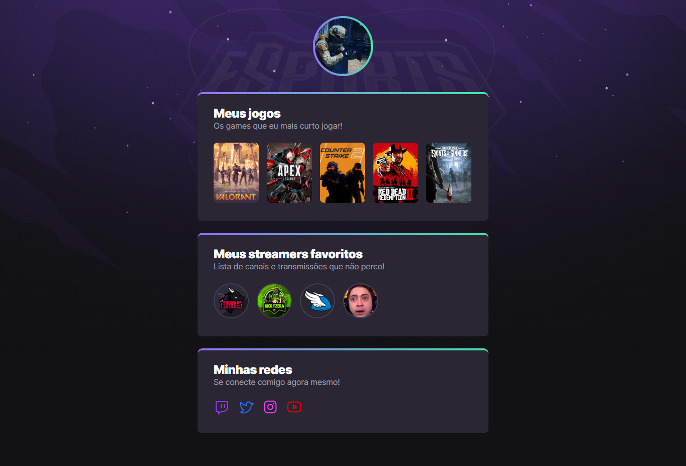

# | <NLW/> #9 eSports | Rocketseat explorer

> Trilha explorer

Projeto construído no evento Next Level Week da Roketseat.

[Clique para acessar a página do projeto](https://furioustg.github.io/nlw-esports-explorer)

## Tecnologia utilizada:
- html
- css
- Git
- Github

## Feramentas utilizadas:
 - Visual Studio Code
 - Figma [link do projeto](https://www.figma.com/file/wcM7Of1DSXTkDGbShUEj97/NLW-eSports-(Community)?node-id=307%3A2056&mode=dev)

